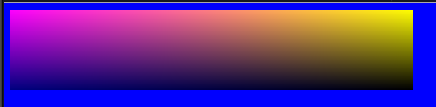

Assignment 03 - Complex Gradient
=============

### Requirements

* Provide a javascript file called "SceneDrawer.js" that has the function:
```javascript
function color(r, g, b, a)
{
   var C = new Object();
   C.r = r; C.g = g; C.b = b; C.a = a;
   return C;
}
```

* and the function:

```javascript
function drawGradient(imageData, upperLeft, upperRight, lowerLeft, lowerRight)
{
   // TODO: implement
}
```

* such that [this file](03/ifiles/index.html), when opened in a browser, will show you this output:



### Self-Assessment

What is true?

* I noted that the color function returns an object.
* I wondered how the color function differs from a constructor.
* I found out about color interpolation (colorLerp).
* I wrote helper functions that drawGradient calls (directly or indirectly).
* I gave my helper functions names that make it clear what they do.
* One of the clear names being setPixel, I implemented this function in 5 lines of code.
* The first line of setPixel sets a local variable to be an offset into the imageData array.
* My output is identical to the shown image.
